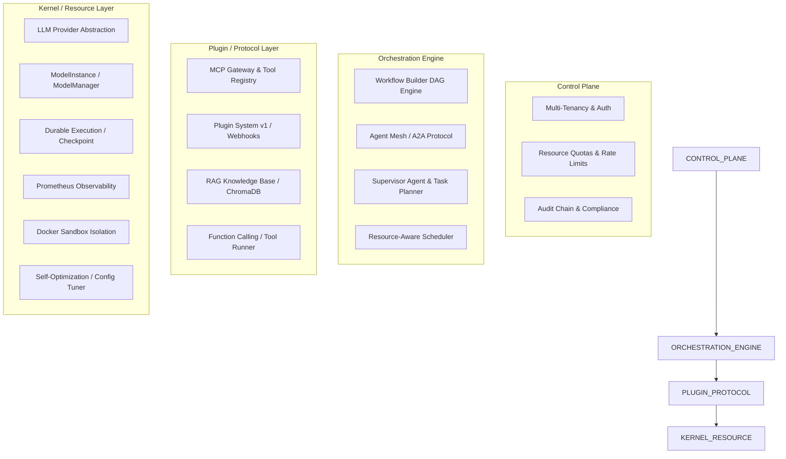
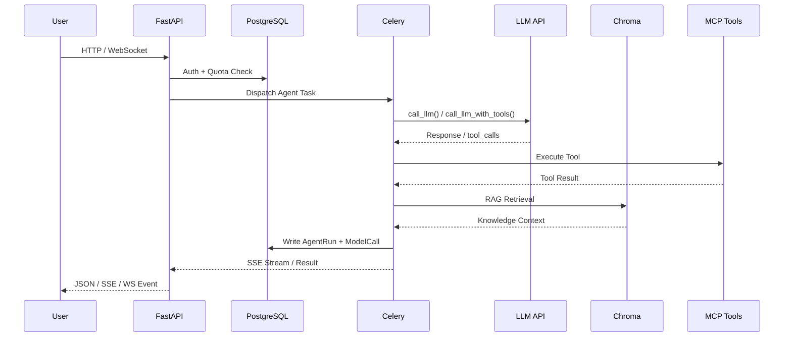

# CrossWave Architecture

## Four-Layer Model

CrossWave is built on a four-tier architecture, inspired by operating system design principles.



## Module Map

| Module | Layer | Status | Tests |
|--------|-------|--------|-------|
| Phase 0-2: Status Machine, Agent Schema, Checkpoint, HITL | Kernel | ✅ | 65 |
| Industry Packs (Social, Finance, Ads, etc.) | Kernel | ✅ | 40 |
| Phase 3: LLM Provider Abstraction (Dify-style) | Kernel | ✅ | 17 |
| Phase 4: Usage Analytics (ModelCall ORM) | Kernel | ✅ | 15 |
| Phase 5: Agent Observability (AgentRun, Monitor API) | Orchestration | ✅ | 30 |
| Phase 6: Supervisor Agent & Task Planner | Orchestration | ✅ | 21 |
| Phase 7: Production Hardening (Errors, Logging, RateLimit) | Control Plane | ✅ | 29 |
| Phase 8: Test Coverage (ModelInstance, Self-Opt) | Cross-cutting | ✅ | 17 |
| Phase 9: Frontend Dashboard (Agents, Runs, Activity) | Control Plane | ✅ | 63 frontend |
| Phase A: Platform OS (Multi-Tenancy, MCP, Quotas, Checkpoint, Plugins) | Control + Plugin | ✅ | 68 |
| Phase B: Agent Mesh (A2A, Capability Registry, Mesh Bus, API) | Orchestration | ✅ | 43 |
| Phase C: True AI OS (Sandbox, Audit, Scheduler, Marketplace, Self-Opt) | Kernel | ✅ | 36 |
| Phase D: Auto-Optimization (ConfigTuner, Base Integration, Rollback) | Kernel | ✅ | 20 |
| Frontend Dashboard v2 (8 new UI pages) | Control Plane | ✅ | 70 frontend |
| Neural Hub Console (Alerts, Health, SSE Logs, Search, Notifications) | Control Plane | ✅ | 67 |
| RAG Knowledge Base (ChromaDB, Document Upload, Agent RAG) | Plugin | ✅ | 53 |
| Agent Function Calling (ToolRunner, Multi-Round, Allowlist) | Plugin | ✅ | 34 |
| Prometheus Observability (Metrics, Middleware, Dashboards) | Control Plane | ✅ | 5 |
| Workflow Builder v1 (DAG Engine, ReactFlow Canvas, API) | Orchestration | ✅ | 34 |
| **Total** | | **15/15** | **~654** |

## Key Data Flow



## Directory Structure

```
polsia-fork/
├── app/
│   ├── agents/          # 19+ AI agents + Supervisor
│   ├── api/v1/          # 16+ API routers
│   ├── core/            # Auth, LLM, Checkpoint, Metrics, Tenant
│   ├── models/          # 30+ SQLAlchemy ORM tables
│   └── services/        # Business logic services
├── celery_app/          # Celery workers + beat schedule
├── frontend/            # Next.js 14 dashboard
│   ├── src/app/         # 23+ page routes
│   └── src/components/  # Shared UI components
├── tests/               # 485+ backend unit tests
├── docker/              # Prometheus, Grafana configs
├── docs/                # Architecture documentation
├── docker-compose.yml   # Full stack deployment
└── nginx/               # Reverse proxy config
```
